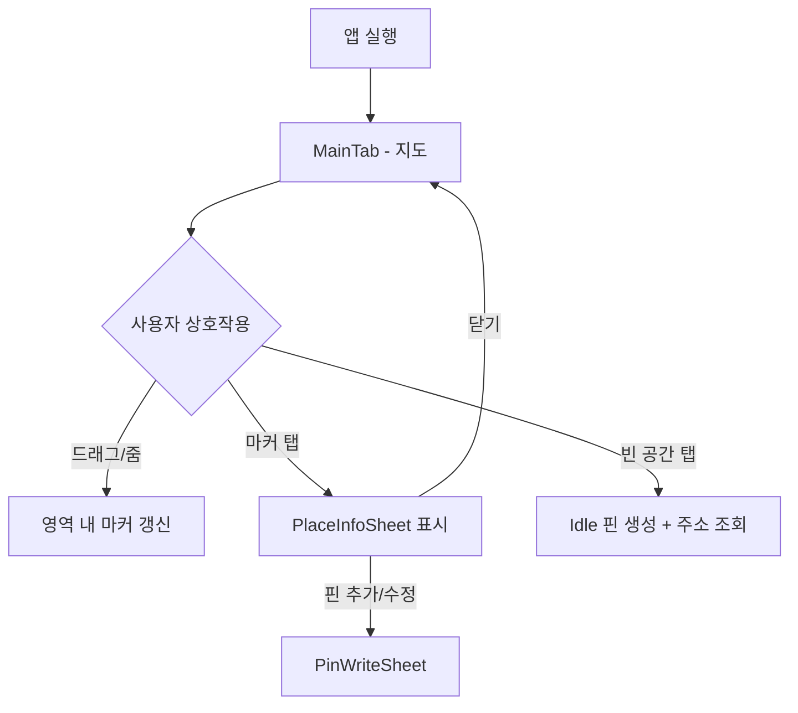
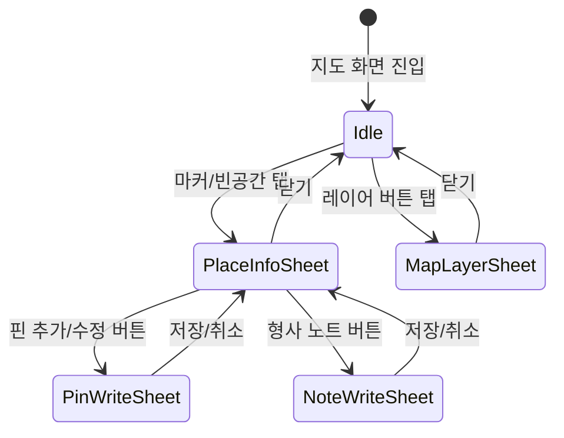
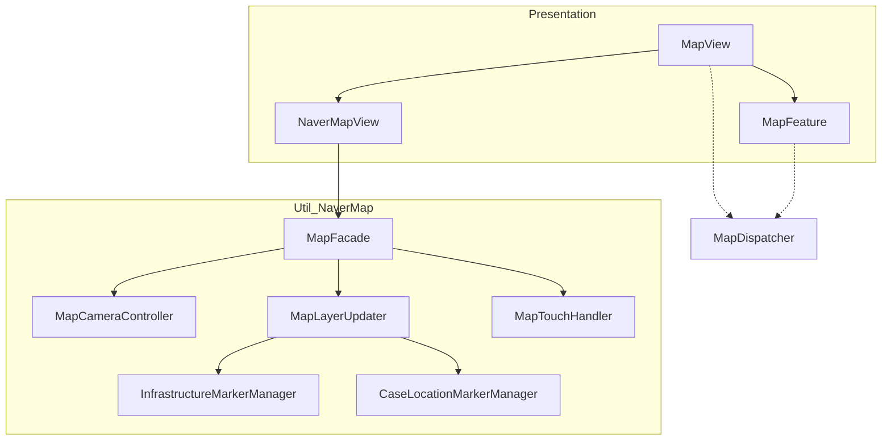

# 지도 기능 (Map Feature)
지도를 통해 사건 위치와 인프라(기지국, CCTV)를 시각화하고, 수사 정보를 탐색하는 핵심 기능입니다.

> 📅 **작성일**: 2026.01.21  
> 👤 **작성자**: 김무찬(Moo)  
> 🏷️ **버전**: v1.0

## 1. 기능 개요

### 기능명
- **Map Feature (지도 관제)**

### 기능 정의

DreamWorms의 지도 시스템은 **Redux 기반 상태 관리**와 **Naver Map SDK**의 UIKit 뷰가 유기적으로 결합된 구조입니다.

``MapFeature``에서 관리되는 State(카메라 위치, 마커 데이터, 시트 상태)는 ``MapView``를 통해 ``NaverMapView``로 전달됩니다. ``NaverMapView``는 내부의 ``MapFacade``를 호출하여 실제 네이버 지도를 갱신합니다.

다른 화면(검색, 타임라인)에서 발생한 지도 명령은 ``MapDispatcher``를 통해 전달됩니다. 이 메시지 버스 패턴을 통해 화면 간 결합도를 낮추면서도 지도 제어가 가능합니다.

### 도입 목적
- 수사관이 **피의자의 이동 동선과 주변 인프라를 직관적으로 파악**하여 효율적인 수사를 지원하기 위함
- 분산된 **위치 데이터, 기지국 정보, CCTV 위치를 하나의 지도 인터페이스로 통합**하기 위해 도입됨

---

## 2. 기능 적용 범위

### 사용 위치
본 기능은 다음 화면 및 상황에서 동작한다.

1. MainTab > MapScene (메인 탭의 지도 화면)
2. 검색 결과 선택 시 ``MapDispatcher``를 통한 지도 이동
3. 타임라인에서 위치 선택 시 ``MapDispatcher``를 통한 지도 이동

### 사용자 관점 동작 조건

1. 사용자가 **지도 탭을 선택**하면 ``MapFeature``가 `startObservingLocations` 액션을 통해 CoreData 변경을 감시하기 시작한다.
2. 지도를 **드래그/줌**하면 ``MapFacade`` 내부의 ``MapCameraController``가 `cameraIdle` 이벤트를 발생시키고, ``MapFeature``는 현재 영역의 CCTV 데이터를 조회한다.
3. **마커를 탭**하면 ``CaseLocationMarkerManager``가 선택 상태를 갱신하고, ``MapFeature``는 `isPlaceInfoSheetPresented`를 `true`로 변경한다.

---

## 3. 화면 흐름도 (Screen Flow)

> 지도 화면 진입부터 장소 상세 확인까지의 네비게이션 흐름



---

## 4. 기능 전체 흐름

### 4.1 시퀀스 다이어그램


### 4.2 흐름 설명

사용자가 마커를 탭하면 ``NaverMapView``의 Coordinator가 터치 이벤트를 감지합니다. 이 이벤트는 ``CaseLocationMarkerManager``의 `touchHandler` 클로저를 통해 상위로 전달됩니다.

``MapView``는 이를 ``MapFeature``의 `.userLocationMarkerTapped(UUID)` 액션으로 변환합니다. ``MapFeature`` Reducer는 해당 Location을 찾아 `state.existingLocation`에 저장하고, `state.isPlaceInfoSheetPresented`를 `true`로 변경합니다.

SwiftUI의 Body가 갱신되면서 ``NaverMapView.updateUIView``가 호출됩니다. 이 메서드는 ``MapFacade.update()``를 실행하여 변경된 모든 상태를 한 번에 지도에 반영합니다.

``MapFacade``는 내부의 ``MapCameraController``를 사용해 카메라를 이동시키고, ``MapLayerUpdater``를 통해 마커 레이어를 갱신합니다. ``CaseLocationMarkerManager``는 선택된 마커의 아이콘을 큰 핀으로 변경합니다.

---

## 5. 상태 다이어그램 (State Diagram)

> mermaid로 만든 이미지를 첨부해주세요.



---

## 6. 의존성 다이어그램 (Dependency Diagram)

> mermaid로 만든 이미지를 첨부해주세요.



---

## 7. 파일 구조

> 지도 기능과 관련된 파일 구조입니다.

```
Sources/
├── 📁 Presentation/
│    └── 🗂️ MapScene/
│         ├── 🗂️ Enum/
│         │    ├── CCTVFetchStatus.swift         // CCTV 로딩 상태
│         │    ├── CoverageRangeMetadata.swift   // 커버리지 반경 메타
│         │    ├── CoverageRangeType.swift       // 커버리지 타입
│         │    └── MapFilterType.swift           // 필터 버튼 타입
│         ├── 🗂️ Model/
│         │    ├── CCTVMarker.swift              // CCTV 마커 모델
│         │    ├── CellMarker.swift              // 기지국 마커 모델
│         │    ├── Location.swift                // 위치 데이터 모델
│         │    ├── MapBounds.swift               // 지도 경계 좌표
│         │    ├── MapCoordinate.swift           // 위경도 래퍼
│         │    └── PlaceInfo.swift               // 장소 상세 정보
│         ├── 🗂️ SubView/
│         │    ├── MapFilterButton.swift         // 필터 토글 버튼
│         │    ├── MapHeader.swift               // 상단 헤더
│         │    ├── MapLayerContainer.swift       // 레이어/현위치 버튼
│         │    ├── MapLayerSettingSheet.swift    // 레이어 설정 시트
│         │    ├── MapSheetPanel.swift           // 하단 시트 통합 패널
│         │    └── PlaceInfoSheet.swift          // 장소 상세 시트
│         ├── MapFeature.swift                   // TCA Reducer
│         └── MapView.swift                      // SwiftUI 뷰
└── 📁 Util/
     └── 🗂️ NaverMap/
          ├── 🗂️ Base/
          │    └── NMConstants.swift             // 지도 상수
          ├── 🗂️ Cache/
          │    ├── MarkerImageCache.swift        // 마커 이미지 캐싱
          │    └── RangeOverlayImageCache.swift  // 오버레이 캐싱
          ├── 🗂️ Controller/
          │    ├── MapCameraController.swift     // 카메라 제어
          │    └── MapLocationController.swift   // 현위치 추적
          ├── 🗂️ Facade/
          │    └── MapFacade.swift               // 통합 인터페이스
          ├── 🗂️ Manager/
          │    ├── CaseLocationMarkerManager.swift    // 사용자 마커 관리
          │    └── InfrastructureLayerManager.swift   // 인프라 마커 관리
          ├── 🗂️ Utility/
          │    ├── MapDataService.swift          // 데이터 가공
          │    ├── MapLayerUpdater.swift         // 레이어 갱신
          │    └── MapTouchHandler.swift         // 터치 핸들러
          ├── MapDispatcher.swift                // 명령 전달 버스
          └── NaverMapView.swift                 // UIKit 래퍼

```

---

## 8. 예외 상황 및 대응 기준

### 예외 상황 1: 위치 권한 거부

- **증상**: '내 위치' 버튼이 동작하지 않음
- **원인**: 사용자가 위치 정보 제공을 거부함
- **대응**: ``MapLocationController``에서 권한 상태 확인 후 설정 화면 이동 유도

### 예외 상황 2: CCTV API 호출 실패

- **증상**: CCTV 마커가 표시되지 않음
- **원인**: 네트워크 불안정 또는 VWorld API 장애
- **대응**: ``MapFeature``에서 `.cctvFetchFailed` 액션 처리, 토스트 메시지 노출

---

## 9. 기능 한계 및 주의사항

- **SDK 의존성**: ``MapFacade``는 Naver Maps SDK 3.17 기준. 업데이트 시 호환성 검증 필요
- **성능 제약**: 마커 500개 이상 시 프레임 드랍 가능. ``InfrastructureMarkerManager``에서 줌 레벨 12 이하 마커 숨김 처리

---

## 10. 향후 개선 사항

### 기능 고도화
- 마커 클러스터링 적용
- 오프라인 지도 캐싱

### 기술 부채
- ``MapDispatcher``를 Combine 스트림으로 리팩토링 검토
- ``MapFeature`` State 분리 (카메라/마커/시트)

---

## 11. 담당 및 참고 정보

| 항목 | 내용 |
| --- | --- |
| 담당자 | (담당자명) |
| 관련 문서 | [Naver Maps SDK](https://navermaps.github.io/ios-map-sdk/guide-ko/) |


## Topics

### Core Components
지도를 구성하는 핵심 컴포넌트입니다.

- ``MapFeature``
- ``MapView``
- ``MapDispatcher``
- ``MapFacade``

### Marker Management
마커 렌더링과 상호작용을 담당합니다.

- ``CaseLocationMarkerManager``
- ``InfrastructureMarkerManager``
- ``MarkerImageCache``

### Map Controllers
지도의 카메라와 위치를 제어합니다.

- ``MapCameraController``
- ``MapLocationController``
- ``MapTouchHandler``

### Data Models
지도에서 사용되는 데이터 모델입니다.

- ``Location``
- ``CellMarker``
- ``CCTVMarker``
- ``PlaceInfo``
